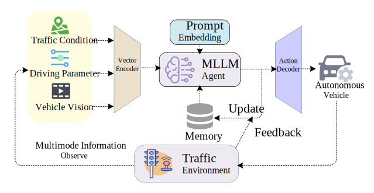



Education
======
* Ph.D. in Computer Science, William & Mary, 2024 - Present
* B.S. in Artifical Science and Technology, Hohai University, 2020 - 2024

Work experience
======
* Xuanjia Ling Technology Co., Ltd: Product manager & Chief financial officer
  * Spearheaded a student entrepreneurial venture, primarily responsible for commercializing our team's product (Interactive Vest for Police Dogs).
  * Managed data processing, practical and ergonomic design of the product, as well as spearheaded marketing efforts.
  * Temporarily stepped back due to academic commitments, during which I gained extensive experience in product design and development, acquiring a comprehensive understanding of the entire product development process.

* College of William & Marry: Research Assistant
  * Collaborated with Professor [Sidi Lu](https://sidilu.org/) from the [College of William & Mary](https://www.wm.edu/) on multimodal large language model for autonomous driving research.
  * Responsible for code development, conducting experiments, and authoring research papers.
  * Produced one research paper currently under review for publication.
  

Publications
======
  <ul>
    
  </ul>
  

Scholarship
======
* International international students opportunity scholarship
* Science and technology innovation scholarship

Awards
======
* National College Students’ innovation and entrepreneurship training program 2022 

  National Excellent Completion

* National College Students’ innovation and entrepreneurship training program 2023

  University Excellent Completion

* China Internet innovation and Entrepreneurship Competition 2021

  Provincial Third Prize

* Chinese undergraduate computer design contest 2022

  National Second Prize

* Chinese undergraduate computer design contest 2021

  National Third Prize

* Teddy Cup data mining competition 2023

  National Third Prize

# Projects

## Research in Multimodal Large Language Model for Autonomous Driving

Multimodal Large Language Models (MLLMs) demonstrate remarkable understanding and reasoning capabilities, presenting a transformative opportunity to overcome challenges faced by traditional AD algorithms. We conducted a comprehensive study on the application of MLLMs in AD, exploring their potential to address critical challenges faced by traditional AD algorithms. We construct a Visual-QuestionAnswering dataset for model fine-tuning to address hallucinations and poor logic analysis issues in MLLMs. We then decomposed the AD decision-making process into Sense Understanding, Prediction, and Decision, allowing MLLMs to construct Chainof-Thought to make decisions step by step. Subsequently, we proposed a new framework enabling models to perform AD tasks under conditions of limited local computing resources, few-shots, multimodality, and complex scenarios, enhancing the flexibility of future AD system deployment.

## Research on Medical Image Processing Methods

The project collaborates with a medical image processing company in Nanjing to develop AI-based pathological analysis of cervical cell slice images. This project has the potential to significantly improve the early diagnosis rate of cancer in patients while greatly reducing the workload of medical professionals.

In this project, the difficult problem is on cell segmentation in Barr’s cell slice images, with the technical challenge lying in the segmentation of overlapping cells. To address the limitations of traditional network architectures, an innovative HARU-Net network model has been developed, achieving segmentation accuracy at the state-of-the-art (SOTA) level.

## Vehicle-Road Collaboration Simulation System for Intelligent Transportation and Algorithmic Practice

This project is an innovation and entrepreneurship project for college students, the research centers on the key technology of building intelligent networked vehicle-road cooperative system for intelligent transportation and algorithmic practice, combining “smart car” and “smart road” together, realizing the intelligent interconnection between car and car and car and road. The project is based on the Linux system and ROS framework, primarily utilizing C++ and Python for implementation. In this project, I mainly contributed in the tuning PID parameters of the vehicles, analyzing and controlling vehicle dynamics, and designing a QR code recognition system on the top of the vehicles to establish a foundation for visual identification and localization.

