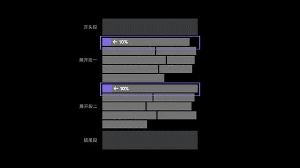
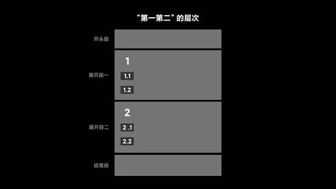
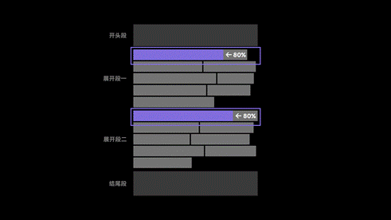
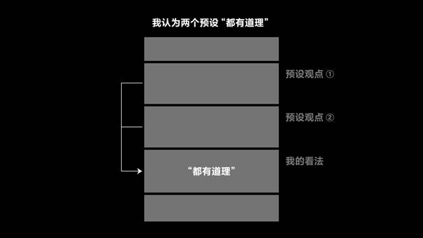
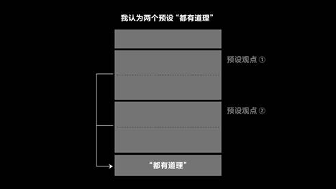
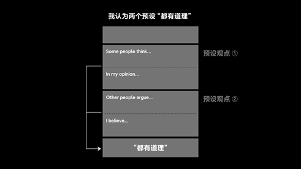
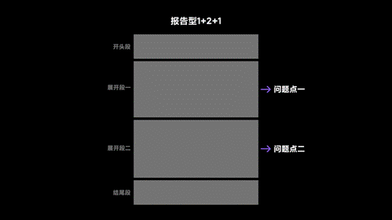
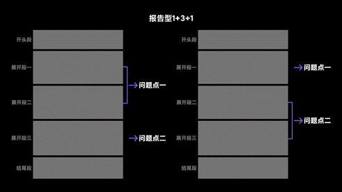
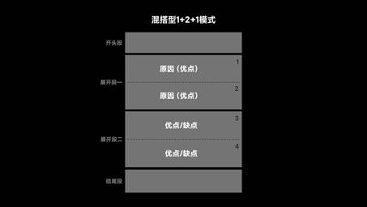
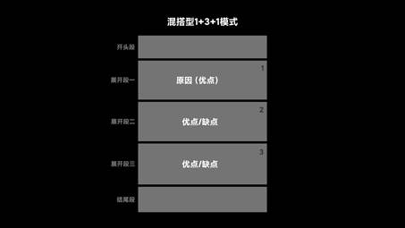

## 5+1种指令类型回顾

好坏型：社会现象 + Do you think it is a positive or negative development?

观点型：观点 + To what extent do you agree or disagree?

讨论型：2个预设观点 + Discuss both views and give your own opinion.

比较型：社会现象 + Do you think the advantages outweight the disadvantages?

报告型：社会现象 + 原因是什么？解决方案是什么？

混搭型：社会现象 + 原因是什么？Do you think it is a positive or negative development?

## 小测试

**Older people, after retirement, choose spending money for themselves (e.g. holiday) rather than saving money for their children. Is it a positive or negative development?**

给定分论点：

1. 老年人可以为自己消费，这可以提高他们的生活便利程度（例如买一些好用的家电），同时也增加他们的幸福指数（例如去旅游或参加庆典活动）。
2. 如果老年人不资助下一代的话，下一代的生活质量会下降（例如健康状况会下降（吃便宜的垃圾食品）、儿童的教育品质会下降（没有足够的能力上更好的学校）

互动问题：写出：2个展开段的第一句话。

 

## 好坏型：展开段的第一个单词可以写什么？

 

- **既然可以写“第一第二”，那么怎么写？**

第一

First/Firstly/First of all

第二

Second/Secondly

Moreover/Furthermore

第三

Third/Thirdly

Lastly/At last

 

总结：对于展开段的第一个单词，有上述储备即可。

 

质疑：

答疑：写作时，不仅有“大一大二”，还有“小一小二”啊！

 

- “小一小二”怎么写？

第一

To begin with

One concern（负向）

Specifically/Primarily（首先我们需要关注的是...）

In the first place

For one

第二

Additionally/In addition

Moreover/Furthermore/What's more

Another concern

Also

For another

 

## 1+2+1行文结构的6个锚点

- Firstly,....
  - To begin with,....
  - What's more,....
- Moreover,...
  - Specifically,...
  - For another,...

 

## 好坏型：推进到展开段的第一句话的80%？（中文）

- **最重要的底线**

底线：回应题目的指令

 先写中文：

要求：

第一，这个现象的一个优点是。。。

第二，这个现象的另一个优点是。。。

相反，这个现象的缺点是。。。

 

## 好坏型：展开段的第一句话怎么写？（英文）

 

### 1+2+1一边倒

First, one positive aspect of X is...

 

Moreover, another positive aspect of X is...

 

 

### 1+2+1中立

First, one positive aspect of X is...

 

However, one negative aspect of X is...

 

- **提问：如果觉得positive aspect过于重复怎么办？**

解决：

First, one positive aspect of X is...

Moreover, X can also bring another benefit to...

 

- **提问：如果感觉第二句话转折语气不够强怎么办？**

解决：

First, one positive aspect of X is...

 

However, it is important to note/acknowledge the negative aspect of X.

 

- **互动：分别写出1+3+1的一边倒和中立的开头句**

### 1+3+1中立（简单！！）

First, one positive aspect of X is...

Moreover, another positive aspect of X is...

However, it is important to note/acknowledge the negative aspect of X.

 

### 1+3+1一边倒（会有问题！！）

First, one positive aspect of X is...

Moreover, a further positive aspect of X is...

Lastly, X can also bring yet another benefit to...

 

## 具体写出分论点：比较两种分论点的优劣

第一种：只概括

First, one positive aspect of X is the improved quality of life.

第二种：写出原因

First, one positive aspect of X is that it can improve the quality of life since X can help people do many tasks.

 

- **哪种方式更好？**

第一种。

因为：咱们可说的内容有限。

1-2

推荐的方式：1、1.3、1.5、1.7、1.9、2（逐层深入）

不推荐的方式：1、2、1.3、1.5、2（先给结论，再展开，有点别扭）

 

 

## 非常重要的同义替换：benefit的使用

X can bring (about) benefits to 【A方面】

X has the benefit for 【A方面】

X is beneficial for 【A方面】

X can benefit 【A方面】

 

 

### 语法超级易错点！

先互动造句：X可以为老年人改善自己的生活带来好处。

提示：X can bring benefits to + 老年人改善生活。

+aged people promoting their lives.

 

先互动造句：老年人使用家用电器的一个好处是改善生活。

提示：One positive aspect of + 老年人使用家用电器 + is the improved quality of life.

+aged people using household appliances

 

### 提问：如果我想让分论点句再概括一些怎么办？

原句（有立场）：首先，改善公共交通的一个好处是提升生活的方便和效率。

First, one positive aspect of improving public transportation is the the increased convenience and effectiveness of the residents' living.

 

改变（去掉立场）：首先，改善公共交通的一个好处是和生活有关的。

First, one positive aspect of improving public transportation concerns people's daily lives.

First, one positive aspect of improving public transportation is related to/associated with people's daily lives.

By doing this, the convenience and effectiveness of the residents' mobility can be greatly enhanced.

 

### “负面影响”的表达

X has disadvantages/drawbacks related to 【A方面】

X can have negative/adverse effects/impacts on 【A方面】

X can negatively impact 【A方面】

X can be harmful/detrimental/damaging to 【A方面】

## 因果关系连接词

because、since/as：都连接原因状语从句。

有什么区别：

because强调：原因

since/as强调：结果

Team or group activities are more beneficial, because they teach skills such as communication, collaboration, and leadership. 

 

Schools have become unnecessary, since people can study through the internet. 

 

 

## 比because、since还重要的因果关系表达

lead：

第一，实义动词，进行同义替换的可能性更大。

第二，我们利用lead，更容易把论证链条写长！

### L的两种用法

 

1. SVO. This can lead to + 直接结果

现象 + 直接结果

Government increased the capacity of the road network. This can lead to more room for cars to travel.

 

2. SVO, leading to/which can lead to + 补充结果

完整形式：SVO. This can lead to + 直接结果，leading to/which can lead to + 补充结果

现象 + 直接结果 + 补充结果

Government increased the capacity of the road network. This can lead to more room for cars to travel, leading to an increased efficiency of traffic flow as a result.

 

### 改善方式一：

Because SVO, SVO, leading to + 补充结果

By doing Sth., SVO, leading to + 补充结果

By increasing the capacity of the road network, there are more room for cars to travel, leading to an increased efficiency of traffic flow as a result.

 

### 改善方式二：

好处：

### lead的直接（水平）同义替换

- “使得”：SVO, allowing/enabling sb. to do sth.

- “促使”：SVO, contributing to...

- “促进”：SVO, encouraging/driving/motivating sb. to do sth.

- “起到了重要的作用”： SVO, which plays an important role in doing sth.

 

### lead的更具体（有方向的）替换

- SVO, promoting/reducing...

- SVO, strengthening/weakening...

- SVO, making it easier/more difficult to do...

原句：By increasing the capacity of the road network, there are more room for cars to travel, leading to an increased efficiency of traffic flow as a result.

替换后（1）：By increasing the capacity of the road network, there are more room for cars to travel, increasing the efficiency of traffic flow as a result.

替换后（2）：By increasing the capacity of the road network, there are more room for cars to travel, which plays an important role in increasing the efficiency of traffic flow.

替换后（3）：By increasing the capacity of the road network, there are more room for cars to travel, making it easier for traffic to flow. 

 

### 用factor（因素）替换lead

中文：A导致B = A是造成B的因素。

互动：造句

不要写成：A is a factor of B

需要写成：

contribute与factor

A is a contributing factor to B, leading to + 补充结果

A is a factor that contributes to B

 

 

## 其他的可以引导因果关系的表达

### therefore、as a result、consequently

用法：引导完整句。（Therefore, SVO）

结论：

One argument in favor of the view that drug companies have a responsibility to spend money on researching medicines for poorer countries is that it is a matter of social justice. Many poorer countries lack the resources and infrastructure to invest in their own research and development, and they rely on the efforts of drug companies to develop new treatments and cures. Therefore/As a result, it can be argued that drug companies have a moral obligation to consider the needs of these countries and to work towards providing affordable access to medicine.

### thus/in turn

第一种用法：与therefore一致，引导总结。

第二种用法：

SVO. This, in turn, can lead to...

SVO, thus leading to...

### which means

解读：“也就是说”，但是本质就是在引导因果关系。

 

公式：SVO, which means that + 导致一个结果（完整句）。

 

By increasing the capacity of the road network, there are more room for cars to travel, which means that this approach can increase the efficiency of traffic flow as a result.  

## 实操练习

**Older people, after retirement, choose spending money for themselves (e.g. holiday) rather than saving money for their children. Is it a positive or negative development?**

 

## 写作

First, one positive aspect of elderly people saving for themselves is related to their lifestyles. To begin with, it is clear that an increasing number of elderly people choose to spend money on some advanced household appliances. These devices can greatly enhance the convenience and comfort of their daily routine, resulting in an improved quality of life. For example, a rice cooker and a microwave oven can reduce the physical effort required on preparing the meals for the elderly people.

In addition, seniors can also spend money on meaningful experiences such as holiday or travel. By engaging in such activities and events, older individuals have the chance to break routine and monotony of everyday lives, thus reducing stress and promoting their overall mental and emotional well-being.

第二课（12月上课操作）

## 观点型指令的框架

针对：2-3个展开段的段首句，也就是分论点句。

## 观点型与好坏型的区别

好坏型：社会现象 + 这个社会现象有优点还是有缺点

观点型：观点 + 你在多大程度上同意或不同意这个观点

 

## 我们先来写中文 

还是通过对比来加深印象。

好坏型展开段的第一句话（中文）：首先，这个社会现象的一个好处是... 

观点型展开段的第一句话（中文）：首先，支持这个观点的一个原因是... 

 

## 英文的写作方式

需要分类来把每一种类型的每一句话写准确。

### 1+2+1一边倒

First, one argument for/in favor of X is...

X = doing sth/sb doing sth

Second, another argument for/in favor of X is...

### 1+2+1中立

First, one argument for/in favor of X is...

However, one argument against X is...

 

### 提问：X can also bring benefit/harmful impact to...真的不能写吗？

答案：可以写。

推荐：但是在第一个展开段别写。可以在第二个或第三个展开段再写。

 

## 实操练习

**When you learn a foreign language, all four skills (listening, reading, speaking, writing) are equally important.**

**To what extent do you agree or disagree?**

分论点1：对于搞科研的人来说，4项能力都是需要的。

分论点2：对于工作中需要外语的人来说，4项能力也都是需要。

分论点3：但是，对于仅仅是为了娱乐的人来说，不需要掌握4项能力。

 

要求1：

要求2：

 

第一段：

First, one argument in favor of mastering four skills concerns those who conduct research.

 

第二段：

Moreover, proficiency in four skills of a foreign language can also bring benefit to those who need to communicate with foreigners in a work setting.

 

第三段：

However, there are also arguments against this/such an approach. 

 

 

## 代词的使用

什么是代词：这个、那个、这些、那些

为什么要在雅思写作中使用代词：

第一，根据语言习惯，我们在说话时，自然而然会使用代词

第二，雅思评分标注中的“连贯与衔接”中，代词的使用是一个评分要点。

### this

基本原则：

用法一：this可以指代前面的一整句话。此种情况下，this单独出现。

Transportation is a major contributor to greenhouse gas emissions, and the increased use of cars can contribute to the warming of the planet. This can lead to a range of negative consequences, including more frequent and severe extreme weather events, sea level rise, and the loss of biodiversity.

 

用法二：this可以指代前一句话中的某一个名词，此时，需要明确指代的对象。

方法：在this后面重复写指代对象这个（1）单词本身，或（2）同义改写。

When people read, they use their imagination to create mental images of the events and characters in a story. This process of visualization can help to stimulate creativity and encourage people to think in new and innovative ways.

 

### that

在大作文写作中，很少使用。

### these

these可以指代：

使用注意事项：

第一，不能指代句子了。

第二，复数概念。

 

We can gain knowledge of different subjects on the internet. These materials/pieces of information/knowledge are helpful for students who are engaging in home education. 

 

1. 找一个意思相同，但是是可数名词的词
2. 不可数名词前+可数的量词

 

### those

单独使用：与that类似

更常见的使用方法：经常结合定语从句使用（those/people+who），表示“那些（具有某种特点的）人。

 

翻译：这可以导致“那些可以接触互联网的人”与“那些不能接触互联网的人“之间的差距的增加。

 

This can lead to a widening of the gap between...

those who can access the internet and those who cannot.

be exposed to students from various backgrounds.

 

### such

总原则：

与this不同：

第一，不能指代一整句话

第二，such可以连接单数名词，也可以连接复数名词。

 

具体用法举例：

such + 复数名词：such approaches

such + a/an + 单数名词：such an approach

such + adj. + 名词：such helpful approaches

 

### so

副词：Doing so is good.

代词（名词）：Such is good.

So is he.

He is so.

 

### doing so的位置

doing so: Doing so is....

in/by doing so: In doing so, sb is....

 

## 逻辑论证之条件if的使用方式

if的主要功能：创建（假想）场景。

联想一下因果关系：

因果：因为A发生，所以B发生。

条件：如果A发生，则B发生。

把下面的句子改写成条件关系：

Since recycling of waste is made mandatory by law, this can drive people to comply.

If recycling of waste is made mandatory by law, people will comply. 

主将从现？？？

答：

 

## 提问：will感觉好生硬，为什么？

原因：

解决方案：

If recycling of waste is made mandatory by law, people can/could/may/might/are more likely to comply.

 

## if引导的逻辑链的延长方式

分析：

原始形式：如果A发生，则B发生。

可行的方式一：1条件+1直接结果+1引申结果

 

可行的方式二：利用“条件关系”本身的特点——“有可能发生”也“有可能不发生”的特点

结论：如果A发生，则B发生。如果A不发生，则B不发生。

 

## 优化句型

原始句型：太啰嗦，而且前后两种情况结合的不够有机。

 

优化：如果A发生，而不是-A，则B发生。相反，B不发生。

 

### 英文举例

延长这句话：If the recycling of waste is made mandatory by law, people are more likely to comply.

如果A发生，而不是-A，则B发生。相反，B不发生。

If the recycling of waste is made mandatory by law

rather than/instead of out of/through willingness,

people are more likely to comply

Otherwise, the waste will be disposed of in a careless manner.

 

## 注意标点

If the recycling of waste is made mandatory by law, rather than through willingness, people are more likely to comply. Otherwise, they rick facing penalties due to breaking the regulations.

rather than部分：介词结构（in the morning）

Otherwise部分：副词

SVO，连词SVO。

SVO。副词SVO。

 

## 程度更深的条件关系

翻译：只要

英文表达：

only if

as long as

连词

 

用法：与if一致

使用场景：根据条件的必要性来判断（很主观）

 

举例：

If the recycling of waste is made mandatory by law, people are more likely to comply. 

这句话可以写成：As long as the recycling of waste is made mandatory by law, people are more likely to comply.

 

### no matter what/where/when

使用方法：连词

翻译：人们可以在互联网上轻松的找到信息，无论他们的专业是什么。

People can easily find information they need on the internet no matter what their field of study is.

### 有没有不需要连接完整句的表达？

答：有

no matter

regardless of

介词

用法：

People can easily find information they need on the internet no matter/regardless of their field of study.

 

## whether

使用方法：

第一点：连词

第二点：whether后面需要连接非常具体的2个或2个以上的列举选项

no matter完整翻译为：...无论X是什么。

whether完整翻译为：...无论X是A，B还是C。

翻译：

人们可以从互联网上获得信息，无论他们的专业是理科、还是文科、还是其他专业。

People can easily find information they need on the internet whether their field of study is science, art or other subjects.

 

## whether的另外两个变体句型

whether it (should) be...

be it...

If she had/should/were...

Had/Should/Were she...

 

## whether的作弊使用方法

直接说结论：与no matter、regardless of联用

为什么可以这么使用：

 

互动：

把下面这个句子（使用条件关系）延长到最长：

People can easily find information they need on the internet regardless of their field of study, whether they are major in science, art, or other subjects.

 

## 展开段实操练习

**Students can easily access information online, so libraries are no longer necessary. To what extent do you agree or disagree?**

 

方向提示：

1.互联网有各种各样的信息

2.互联网有多媒体的内容（增加体验感）【语料：互联网的特点】

First, one argument in support of internet replacing the libraries is the effectiveness of abtaining information from the internet. To begin with, as long as people have an Internet connection, they have unrestricted access to a wealth of information, regardless of their profession, whether it be in science, engineering, or art. Otherwise, they would risk wasting substantial amount of time searching for relevant books in the libraries. In addition, the internet can provide people with multimedia educational resources, such as images, audio and video clips, and interactive quizzes. Therefore, by making full use of such pieces of information online, people can absorb and master knowledge more efficiently, thus resulting in a decreased reliance on libraries.

 

## 强调逻辑最常用的引导词

especially，particularly，in particular

 

### 用法一：延伸成分

用法：把要强调的对象，用一个词或一个短语进行具体化。

公式形式：

增加强调逻辑之前：A会做X动作。

增加强调逻辑之后：A，especially A1，会做X动作。

Documentaries provide visual evidence of historic events, making it effortless for viewers to comprehend what occurred during that time.

Documentaries provide visual evidence of historic events, making it effortless for viewers, especially young children, to comprehend what occurred during that time.

 

### 用法二：延伸完整句

用法：把要强调的对象，拓展成一个完整句。

疑问：

公式形式：

增加强调逻辑之前：A会做X动作。

增加强调逻辑之后：A会做X动作。In particular，A1，（更）会去做X动作。

 

Documentaries provide visual evidence of historic events, making it effortless for viewers to comprehend what occurred during that time.

In particular, young children can have a better learning experience.

 

继续延长:

刚刚的逻辑链条：A会做X动作。In particular，A1，（更）会去做X动作。

补充一个模块：A会做X动作。In particular，A1，（who/which）具有某种特点，（更）会去做X动作。

Documentaries provide visual evidence of historic events, making it effortless for viewers to comprehend what occurred during that time.

In particular, young children, who may have difficulty focusing, can have a better learning experience.

 

### 另外一个相似的表达（把强调延伸成一个句子）

结论：This is especially true/beneficial/harmful for Sb. + who + 某种特点。

使用方法：

Documentaries provide visual evidence of historic events, making it effortless for viewers to comprehend what occurred during that time.

This is especially true for young children who may have difficulty focusing.

 

## 延伸刚刚的实操练习

First, one argument in support of internet replacing the libraries is the effectiveness of abtaining information from the internet. To begin with, as long as people have an Internet connection, they have unrestricted access to a wealth of information, regardless of their profession, whether it be in science, engineering, or art. Otherwise, they would risk wasting substantial amount of time searching for relevant books in the libraries. In addition, the internet can provide people with multimedia educational resources, such as images, audio and video clips, and interactive quizzes.

This is especially beneficial for those who struggle to focus and concentrate.

Therefore, by making full use of such pieces of information online, people can absorb and master knowledge more efficiently, thus resulting in a decreased reliance on libraries.

 

## 实操练习写作第二段

**Students can easily access information online, so libraries are no longer necessary. To what extent do you agree or disagree?**

总分论点：不同意取消图书馆【词汇：重视与忽略】

分支子论点1：

图书管理员（有知识和经验）【语料：学生及老师的特点 - 老师的优点】

可以帮助去图书馆的人选择书籍

分支子论点2：

人们可以在图书馆中交流

图书馆有会议室

人们可以面对面交流【语料：互联网交流 - 互联网交流的缺点】

可以看到人们的表情、肢体语言、眼神

 

## 好坏型大作文的首尾段

第一，话题同义改写

第二，总观点

## 总观点应该怎们写

总原则：直接回应指令。

### 最概括的写法

100%倾斜：I believe that this is a positive/negative trend.

70%倾斜：I believe that this is generally a positive/negative trend.

50%倾斜：I believe that this trend has both positive and negative sides.

### 提问：可以稍微具体一点吗？

可以写：存在优点或缺点的大方向

中文翻译：“在某个层面”是有优点的或有缺点的。

on a personal level

on a societal level

on an environmental level

on an educational level

 

### 提问：“从日常生活的层面”应该怎么说？

on the level of daily life

### 带着“层面”写出总观点的完整句

I believe that this development has both positive and negtive sides on personal and societal level.

## 结尾段怎么写

需要：同义改写分论点

不需要：单独重复总观点

 

## 结尾段举例

分论点1：X有A和B的好处

分论点2：X有C和D的坏处

In conc.lusion, X can bring benefits in terms of A and B. However, it is also crucial to acknowledge the potential negative impacts. This can include C and D.

 

## 结尾段的延长方式

增加：建议

 

## 观点型大作文的首尾段

## 首段的简单写法

第一，话题同义改写

第二，总观点

 

## 总观点应该怎么写

总原则：直接回应指令

好坏型：I believe this is a positive/negative trend/development.

观点型：

100%：I agree/disagree with this statement/idea.

70%：I generally agree/disagree with this statement.

50%：I have a mixed attitude towards this idea.

 

 

## 会有一些辩证的题目

什么是辩证的题目：

举例：有些人认为：A应该为B服务，而不应该为C服务。你在多大程度上同意或不同意这个观点。

 

## 对于辩证题目：开头段常规/概括的写法

l 我同意这种观点。

¡ A服务B，A不服务C

l 我不同意这种观点。

¡ A不服务B，A服务C

¡ A不服务B，A也不服务C

¡ A同时服务B+C

 

## 对于辩证题目：更高阶（直接明确）的写法

总原则：

方法：

l 我们不用一句话（同意/不同意）去概括对于【2个部分的观点】的态度；

l 相反，我们针对【2个部分的观点】，我们分别给出对应的态度。

l 先写我们不同意的部分。再写我们同意的部分。

 

## 观点型大作文开头段实操

**It is more important for school children to learn about their local history than world history. To what extent do you agree or disagree?**

## 同意学习local history（不同意学world）

I do not agree with the idea that it is vital for students to learn about world history. Instead, I believe it is essential for them to have a thorough understanding of local history.

 

## 同意学习world history（不同意学local）

In my opinion, student should not prioritize studying local history. I believe that learing about world history can provide significant advantages.

 

## 同意都学

While learing about local history is beneficial for students, I believe that being knowledgable of world history is also necessary in the modern age.

 

额外的好处：不再需要单独的对话题的同意改写。

 第三课（12月上课操作）

# 讨论型指令的结构框架

## 回顾指令要求

话题：2个预设观点

第一部分：discuss both views

第二部分：give your own opinion

## 导致：稍微不同的分段方式

开头段：

第一个展开段：对第一个预设观点的discuss（支持）

第二个展开段：对第二个预设观点的discuss（支持）

第三个展开段：我的看法

结尾段： 总结

 

# 前两个展开段（预设观点）段首句的写作方式

为什么先讲这两个段落：

底线原则：必须使用第三人称。

 

## 标准写法

l First, some people argue that…

¡ To begin with, they believe that...

¡ For anther, they also claim that...

l However, other people argue that…

 

## 变化写法

On the one hand, it could be argued by other people that... 

On the other hand, a different perspective is held by others who believe that...

也可以使用：proponent/opponent

 

# 补充：人称的使用

## 一个段落中人称需要统一

表示大众：

第一人称：we (I)

第三人称：people、individuals、everyone

 

表示特定人群：见语料库

 

## 尽量避免

尽量避免：在论证过程中，使用单数的人称：he or she

为什么：指代的时候很麻烦

举例时：单数复数均可，性别自定。

 

列举details

举例example

# 逻辑论证之列举

## 对于列举，我们需要学习什么？

 

## 列举的语法规则

2项并列：A and B

3项+并列：A, B, and C

注意：尽量不要使用etc这个表达；

应该使用A, B, and other X-related something.

 

obesity, heart diseases, and other health related issues.

bicycles, personals cars, and other vehicles/transport related methods 

 

## 4种替换的句型

### such as\like

句型：[ ]such as[❌] A, B, and C

注意：

 

I don't like [-] people such as him.

I like my pets, such as my cat and dog.

 

限定的情况：不加逗号

非限定的情况：加逗号

 

### include

一种方法：SVO, including A, B, and C

 

另一种方法：SVO. This may include A, B, and C.

 

### 列举单独成句的另外一个方法

### A and B are two ways

### A, B, and C are three ways.

造句：鼓励创新和投资教育是两种可行的方式。

Encouraging innovation and investing in education are two potential approaches.

 

# 逻辑论证之举例

## 为什么要讲举例

# for example, for instance就不讲了

附加：

For example/instance, SVO.

Sometimes, SVO.

A case in point, SVO.

 

# 扎心的问题：有多少同学只会使用for example或for instance进行举例？

 

# 可以直接使用逗号或冒号代替for example

 

冒号方法：SVO: SVO.

冒号的语法规则：

SVO: sVO.

SVO: noun.

SVO: A, B, and C

 

A, B, and C [--] SVO.

 

逗号方法：S1 VO, (with) S2 VingO

S1VO, AND S2VO

表达：

## 补充：独立主格的语法现象

第一步：SVO, doing sth.

第二步：SVO, Sdoing sth.

 

I went home, with the temperature dropping gradually.

I love my mother, with she working in the garden.

 

## 举例

Television programs can be extremely addictive. For example, soap operas and animated shows draw in young audiences through their entertaining characters.

冒号：

Television programs can be extremely addictive：soap operas and animated shows draw in young audiences through their entertaining characters.

 

逗号：

Television programs can be extremely addictive，soap operas and animated shows drawing in young audiences through their entertaining characters.

 

# imagine引导举例

使用方法一：Imagine + 名词（宾语）。SVO.

回答：祈使句，省略了主语you

完整形式：(You) imagine Sb./Sth.

 

逻辑链。Imagine a student + who.... He...

 

使用方法二：Imagine that + 句子

完整形式：(You) imagine that SVO.

 

翻译：

一个学文学的学生。搜索有关莎士比亚的信息。互联网可以帮助他快速获取相关的信息。

Imagine a literature student who is searching for information on Shakespeare.

 

Imagine (that) a literature student is searching for information on Shakespeare.

 

The internet can provide him with related knowledge almost instantly.

 

 

# Imagine的替换

Consider a student. SVO

Suppose a student whooo.. SVO

Take a student for example. SVO

 

# 标点符号的注意事项

Imagine (that) a literature student is searching for information on Shakespeare。/；

The internet can provide him with related knowledge almost instantly.

 

SVO; SVO.

我考了高分。他也考了高分。

 

# while引导举例

## while与举例有什么关系？

A and B

SVO while SVO

 

## 举例

互联网可以帮助同学们更好的学习知识，such as 数学概念 and 物理现象。

 

互联网可以帮助同学们更好的学习知识。例如，数学的学生可以通过互联网学习数学概念，while 物理的学生可以通过互联网学习物理现象。

The internet can help students acquire knowledge more effectively.

Math students can master difficult concepts through the use of the interactive tools on the internet, while physics students may gain a deeper understanding of natural phenomena by watching online videos.

 

# 逻辑论证之让步

# although/while

表示：

用法：连词

Although SVO, SVO.

 

1+3+1：2:1

Although 1, 2

1+2+1：1:1

While 1, 1

 

# in spite of/despite/notwithstanding

表示：虽然但是

用法：介词 + 名词

表达：Despite N, SVO.

Despite the bad weather/rain, we still went shopping.

如果想引导从句：Despite the fact that SVO, SVO.

Despite the fact that it was raining outside, we still went shopping.

 

# nonetheless/nevertheless

用法：然而

翻译：（虽然已经发生了很多事情）然而最终还是。

类似：Therefore（总结性比较强）

Despite the pressure on the environment resulted from consumption, factories continued to increase their capacity. Nonetheless/nevertheless, the economy was able to achieve growth.

 

# admittedly

翻译：诚然、确实。

特定语境：通常作为让步段的开头。

变化：

First, one benefit of X is...

Moreover, another benefit...

However, it is important to note the negative effects of X...

让步：

Admittely, one negative effects of X is...

However, it is important to note the benefits...

Moreover, another benefits...

 

变化

Admittedly/we need to admit that...

It is true that...

There is no denying that...

 

# 实操练习

**Some people believe that using modern technology (digital photographs, blogs) is the best way to record and remember important personal events.** **Others think traditional methods (making photo albums, writing diaries) are better.** 

**Discuss both views and give your own opinion.**

分论点方向指引：

第一个展开段：

分支1：电子设备记录方便

分支2：容易保存和分享

第二个展开段：

分支1：纸质版记忆可以传递更真实的触感和情感

分支2：纸质版的记忆可以被个性化

【语料：电子对比纸笔】

 

Some people argue that digital technologies can enhance our ability to record and preserve personal memories. To begin with, these technologies make it effortless to document personal experiences, particularly those engaged with family and friends. Imagine a group of family members are participating in a backpacking in a forest. They can capture their adventures in real-time with the help of their smartphones. In addition, memories in digital formats, such as digital photographs, video and audio clips, and blogs, are straightforward to store and share: with just a few clicks, people can send the memories to each other and travel back in time to enjoy the cherished moments together.

On the other hand, others believe that traditional methods of preserving memories are superior to the digital ones. For one, in spite of the fact that digital devices are easy to use, printed photos and written diaries can be seen and touched, which can provide a tangible experience of the memories to the viewers. Sometimes, people can feel that they are interacting with a loved one who has passed away when holding a picture of this person. What’s more, the owners can customize their photo albums and written diaries, adding a personal touch to the these items. Some people might choose different formats and materials for different events, while others might decorate them with notes and stickers, making them unique and special.

 

# 讨论型大作文首尾段

# 首段的写法

从组织角度讲：还是两个部分

1. 对话题的复述
2. 总观点（我的看法）

 

## 对话题的复述部分

改写关系

中文：关于X，有两种对抗性的观点。

There are two different perspectives regarding X.

There has been a conflict about X.

 

### 举例

**Some people think it is necessary to travel abroad to learn about other countries, while others think that it is not necessary to travel abroad because the information can be seen on TV and on the Internet. Discuss both opinions and give your own opinion.** 

改写句：

There are two different/conflicting perspectives regarding how to learn about other countries.

 

# 开头段“我的看法”

一共有2大种方式：

 

# “我的看法”部分的模式分类

## 开头段“我的看法”方式一：倾向一个预设观点

I am more inclined to agree with A.

I have a stronger inclination towards agreeing with A.

I believe there is a way to resolve the negative impacts of B.

模版句：

In this essay, I will discuss the two views and present my own perspective on this.

 

## 开头段的“我的看法”说完了，接下来就需要具体展开了！

## 方式一：倾向一个预设观点

实现逻辑：为你支持的那个观点，再找一个支持的理由，最终整体形成2：1结构

### “我的看法”展开段段首句（分论点）：

（为了讲解方便）题目模型：

有些人认为X会带来好处；另外一些人认为X会带来坏处。讨论两个观点，并给出你自己的看法。

 

中文：

预设1：有些人认为X会带来好处。

预设2：另外一些人认为X会带来坏处。

我的看法：在我看来，X还会带来另外一个好处。

 

 

英文：

In my opinion, X can also bring benefits to...

 

### 第二句话之后：

按常规方式写作即可——给出一个分支论点的展开。

 

# 结尾

方法：对3个展开段的分论点进行再次的概括（同义改写）。

In conclusion, 预设观点1及2的同义改写。

I believe + 我的看法的同义改写。

 

 

## 举例

**Some people think advertising may have positive economic effects. Others think it has negative social effects because individuals are not satisfied with who they are and what they have. Discuss both views and give your opinion.** 

## 方式一：倾向一个预设观点

开头段：There are conflicting perspectives on the effects of advertisement. In this essay, I will discuss the two views and present my own perspective on this.

第一段：Some people argue that advertising can serve as a contributing factor that drives innovation.

第二段：Other people argue that advertisement can cause harm to public values.

我的看法（支持正）：In my opinion, advertising can also promote employment.

结尾段：In conclusion, although advertising have some drawbacks, since it can bring positive effects to the economy, including promoting both innovation and employment, I believe it is generally beneficial to the society as a whole.

 

# 方式二：我认为两个预设观点都有道理

## 开头段的总观点

需要表达：

英文：I hold the view that both opinions all have their merits.

或直接写模板：In the following essay.....

 

## 讨论预设观点段

与前两种方式一模一样。

 

## “我的看法”段落的尴尬

尴尬在于：

 

## 解决方案：分支子论点的分布方式的调整

展开段一：他+我

展开段二：他+我

我的看法+结尾段：

在我看来，预设观点1对AB有好处；预设观点2对CD有好处。因此，我们需要找到他们之间的平衡。

 

### “平衡”的英文表达 

【词汇：平衡及优先】

strike/achieve a balance

 

## 举例

**Some people believe that university education should focus on the skills of employment for the future. Others think that university education should focus on academic study only. Discuss both views and give your own opinion.** 

开头段：There are conflicting views on the type of knowledge or skills univeristy education should offer. In my opinion, both views have their merits.

第一段：Some people argue that univerisity should provide programs mainly focusing on vocational skills for the students. + 理由1

In my opinion, vocational programs can also bring benefits to... + 理由2

第二段：Other people argue that academic study in university education should be solely prioritized.+ 理由1

I believe that academic study is also beneficial for...+ 理由2

我的看法+结尾：In my opinion, both vocational skills and academic knowledge are essential for the personal and professional development of students. The institutions should strike a balance between the two approaches.

 

 

 ## 比较型指令的结构框架

## 题型回顾

话题部分：社会现象

指令部分：你认为这个社会现象的优点是否大于缺点（Do you think the advantages outweigh the disadvantages）

## 首先需要注意的要点

第一，必须写中立

第二，需要有”倾向“

 

问题：“倾向”如何产生？

答案：

## 穿插一个小提问：先写优点还是先写缺点？

通常：通常先写优点。

 

## 如何确定谁大于谁？

### 1+3+1的形式

写法：与1+3+1的好坏型文章展开段段首句一模一样。

最终：2:1

举例：

First, one advantages of X is...

Moreover, a further benefit of X is...

However, it is important to note that X can also cause harm to...

 

## 如果写1+2+1的形式

### 第一个展开段的首句

写法：First, one advantage of X is (that)...

 

### 注意：第二个展开段的首句的写法

1. 首先：引出一个社会现象的缺点；
2. 附加：我们可以把这个缺点进行“强调”或“削弱”。

为什么要这样做：主动从”措辞“上创造“倾向”

 

### 具体操作方法

First, one advantage of X is (that)...

 

However, we also need to note/acknowledge the negative aspects of X.

第二步，

However, we also need to note the more concerning/relatively minor negative aspects of X.

 

 

提问：

加强：more concerning/alarming

减弱：less concerning/relatively minor

 

问题：是不是段首句这么写，就意味着段落中的内容也要”更严重”或“更不严重”

答案：不需要（6.5/7），想到什么就写什么。

 

## 论证逻辑之对比

对比逻辑的本质：相反（正话反说）

正话反说的本质：对已有内容的反向“同义改写”

 

### 对立成分：rather than/instead of

翻译：而不是/不仅仅是

句型：SVO.

Every individual possesses the capability to grow into responsible and contributing members of their community, rather than/instead of participating in actions that cause harm or destruction to society.

### 语法：rather than do还是rather than doing

rather than doing

例外：would rather do than do

 

## 对立句子：without+N/on the contrary/otherwise/conversely

翻译：相反，如果没有...

句型：

SVO. On the contrary/Otherwise/Without N, SVO.

OOOOOOO.    However, SVO.

 

in spite of：介词+noun

without+Noun：副词（短语）

OOOOOOO.    For example, SVO.

In the morning, SVO.

 

Public services are sustained by the financial support provided by the government.

Otherwise/Without such necessary fund, society would be unable to operate efficiently and effectively.

 

### without which

相同：表意

不同：词性（连词）

改写：

Public services are sustained by the financial support provided by the government, **without which** society would be unable to operate efficiently and effectively without which.

介词+which 引导定语从句

 

我发明了一个系统，通过这个系统我们可以认识彼此。

I innovated a new system, by which we can know each other.

那有一扇门，门后我弟弟在那哭。

There is a door, behind which my brother is crying.

 

### in fact

翻译：事实上

常用场景：与否定词（however、not等）联合使用，消除一种（他人的）误解或狭隘的看法。

更逻辑化的翻译：

1. 是...并且更是...
2. 不是...而是...

However, it is also true that mental attitude is a vital component of success in sports. In fact, some people argue that mental attitude is even more important than physical fitness.

However, it is also true that physical fitness is not the only component of success in sports. In fact, some people argue that mental attitude is even more important than physical fitness.

总结：(经常）对转折之后的句子进行进一步的加强。

虽然A，但是B，in fact B+。

回到比较型段首句举例：

First, one positive aspect of X is...

However, we also need to note the negative aspects of X. In fact, X can cause more concerning harm to...

## 论证逻辑之并列

### as well as的用法

思考：as well as + do? doing?

I watched TV as well as playing basketball

### not only but also/while

语法：

第一，前后必须都是完整句

第二，but不能省略

答：并列谁就紧挨着谁。

我会说汉语+英语。

I can speak not only Chinese but also English.

我+他会说英语。

Not only I can speak English, but also he can speak Enligsh.

 

## 倒装

### 部分倒装：

引发条件：否定词、极端词开头时

动作：提前助动词（到主语前面）

Not only can I speak English, but also he can speak Enligsh.

 

### 完全倒转：

引发条件：强调

动作：

提前被强调内容到句首

提前所有谓语动词部分（到主语钱）

My cat is lying on the ground.

On the ground is lying my cat

 

## 比较型指令开头段及结尾段

对话题进行改写部分：略

给出观点部分：必须体现“倾向”

方式一（outweigh）：I believe that the drawbacks of this trend outweigh the benefits.

方式二（让步）：Although X may have some advantages, it can cause more serious harm.

 

## 比较型指令结尾段怎么写？

需求：总结分论点

附加：最好能把“谁大于谁”的结论融合在分论点总结中

 

分论点：

X有A和B的优点；

X有C和D的缺点。

 

中文：虽然X有A和B的优点，但是C和D的缺点会带来更大的消极影响。

 

英文：Although X may offer benefits to A and B, the adverse effects on C and D are more substantial and should be taken into consideration.

 

## 比较型指令框架写作举例

**The use of social media, such as Facebook, Twitter, are replacing face-to-face contact in this century. Do you think the advantages of this development outweigh the disadvantages?**

开头段

An increasing number of people are spending a significant amount of time on social media, interacting with friends through communication and gaming. From my perspective, the benefits of such a trend outweigh its drawbacks.

展开段首句

First, the widespread availability of the internet and social media has greatly improved our ability to communicate.

Furthermore, another advantage of social media is associated with its engaging and immersive experience.

However, we need also note one relatively minor drawback of the social media.

结尾段

To conclude, even though social media can be addictive, it is more important for us to acknowledge its positive aspects in terms of the enhancement of people's communication and experience.

 

## 报告型指令的结构框架

### 题型回顾

话题：社会现象

问题：（1）原因或结果；（2）解决方案

What is the cause of this trend?

What causes this trend?

What does this trend cause?

 

## 如果写作展开段的首句（2个问题点怎么分配）

### 1+2+1模式

### 1+3+1模式

## 报告型指令的开头段及结尾段

The main reason/consequence for X concerns...

 

To address/combat/solve this issue, A (and B) should take on the responsibility/take appropriate measures.

 

## 报告型指令的开头段

### 第一句

话题（社会现象）同义改写。

### 第二句

直接使用模板句即可：“引出下文“的动作

In this essay, I will explore the causes of X, and what can be done to reduce its effects.

 

## 报告型指令的结尾段

分别概括2-3个分论点。

 

## 报告型框架写作举例

**The natural resources such as oil, forests and fresh water are being consumed at an alarming rate. What problems does it cause? How can we solve these problems?** 

开头段：The natural resources are being exploited and consumed by humans without stops. In the essay, I will explore the impacts and solutions to this trend.

展开段

The main impacts of the overconsumption of natural resources is the degradation of the overall ecosystems.

 

To combat this issue, it is crucial for government to take on its responsibility.

结尾段

In conclusion, given the disastrous consequences of depleting natural resources, it is crucial for governments to play a key role in ensuring their sustainable use and protection for future generations.

 

## 混搭型指令的结构框架

### 混搭型的2个问题点通常是什么？

2个问题点的总特点：

第一问：Why does this happen（问原因）

第二问：Do you think it is a positive or negative development（问好坏）

 

 

## 如何写作展开段的第一句话？

注意：

一种情况：原因是原因，优缺点是优缺点。

**In some countries, more people choose to live by themselves in recent years. Why is this the case? Is it a positive or negative development for society?**

 

多数情况：

**Nowadays, some parents put a lot of pressure on their children. Why is the reason for doing that? Is this a positive or negative development for the children?**

 

## 1+2+1模式

图示

总结：不管别的，就数数优缺点的数量（1共4个），构思难度是比较大的。

 

## 1+3+1模式

图示

总结：优缺点的数量只有3个，构思难度更小。

 

## “分配原因和优缺点”推荐的模式

### 一边倒

（优点1）原因

（优点2）原因/好坏

（优点3）好坏

 

### 中立

所有“优点”都放在“原因”部分写。

所有“缺点”都放在“好坏”部分写。

 

X的原因一是（优点1）

X的原因二是（优点2）

但是，我认为X也有缺点（缺点1）

One reason for X is...

Moreover, another reason for X is...

However, I think X can also bring negative effects to...

 

## 混搭型指令的开头段及结尾段

### 开头段

改写：

总观点：

In this essay, I will explore its reasons and give my opinion.

 

## 结尾段

### 情况一

写法：分别概括“原因”及“好坏”。

中文：X的原因是A和B。我认为X有在C和D方面有积极或消极的影响。

 

### 情况二

写法：优点写一起；缺点写一起。

中文：X的原因是A和B。虽然有（上述这些）优点，但是我认为X也会存在消极的影响。

 

## 混搭型框架写作举例

**Nowadays, some parents put a lot of pressure on their children. Why is the reason for doing that? Is this a positive or negative development for the children?**

开头段

Some parents tend to exert excessive pressure on their children. In this essay, I will explore the reason for this trend and present my perspective on this.

展开段

One reason for this trend concerns the education.

Moreover, another reason for such a trend is that it can help children regulate their own behaviour.

However, as for me, too much pressure can leave children with little time to enjoy their hobbies.

结尾段

In conclusion, many parents choose to put pressure on their children in order to help them become knowledgeable and responsible individuals. While this can have its benefits, I believe too much pressure can also prevent children from pursuing their true interests.

 

## 混搭型指令构思实操

**In some countries, more people choose to live by themselves in recent years. Why is this the case? Is it a positive or negative development for society?**

 

A growing number of people opt to live independently in recent years. In this essay, I will explore the reason for this trend and present my own view on this.

One of the main reasons for this trend is with respect to the internet. People can use internet to keep connected with their loved ones. An individual can share his updates on the social media and comment on those of others, while he can also video chat with his families and friends through instant messaging. Under such circumstances, many people, especially the younger generation prefer to live by themselves, since they are less likely to feel the sense of loneliness or isolation.

In my opinion, one of the positive aspects of this trend concerns the economy. Many people living by themselves tend to purchase a variety of advanced household appliances, since these devices can promote the convenience and comfort of their living. Consider a student who owns a set of household devices, including a rice cooker, dishwasher, and cleaning robot. He can rely on these devices to make his daily routine easier. Such an increased demand for these products encourages businesses to invest more in research and development, and thus leads to greater economic growth.

Moreover, in addition to boosting the economy, this trend can also bring benefits to the environment. A growing number of people living independently choose to share apartments with other people in urban areas, which means they can use public transportation to get around rather than driving personal cars between residential and commercial areas. Public transportation produces fewer greenhouse gases and toxic chemicals to the air, thereby preserving a better living environment for the overall society.

In conclusion, more people enjoy the way of living by themselves due to the advancement of the internet, and this trend has brought about positive impacts to the economy and the environment.

 