第五课（12月上课操作）

## 把图表类小作文写好的总原则

一共有三点原则：会组织、换表达、多合并

 

注意：语言最重要

 

## 概述段内容选取的总原则

内容总量：1~2

## 最优解

总原则：通过“看型”来提取内容。

操作：

**The chart below contains informtation about the percentage of male and female students who enrolled diffferent subjects in 1995.**

**Summarize the information by selecting and reporting the main features and make comparisons where relevant.**

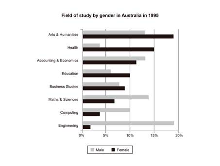

总内容量：

第一点：黑色柱子，上半部分高一些；灰色的柱子，下半部分高一些。

第二点：黑与灰之间的差距变化比较大。

 

中文：

总体来说，男生选择学习理工科的比例比较高；而女生选择文科的比例比较高。

对于不同专业，男女的专业选择比例差别较大。

 

英文：In general, a higher proportion of males choose to study STEM fields, while more females prefer to study humanity-related subjects. Moreover, it is noticeable that there is a significant disparity in major choices between genders across various fields of study.

 

## 补充3点

第一，

第二，

第三，

【表达：无表义的引导词】

 

## 次优解

可以：在概述段写“极值”或“极端趋势”。

注意：细节

 

也有改进方法：

第一，同意改写（不要去写具体的值）

第二，Overview放到最后

 

### Overview举例

中文：

第一点： 男生最喜欢engineering；女生最喜欢arts and humanities。

 

细节段的第一句：The highest proportion of male students chose engineering, at...

 

英文：Overall, engineering was the first choice for men...

 

 

## 因此：提升方法

写10篇

 

## 先说最简单的：折线图及表格

原则：

**The graph below gives information from 2008 report about consumption of energy in the US since 1980 with projection until 2030.**

**Summarize the information by selecting and reporting the main features and make comparisons where relevant.**

# 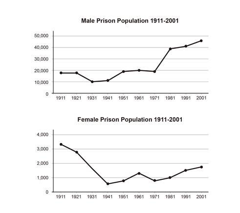

 

### 重点难点：对柱状图和饼图的细节信息分类方法

二维图表：只有两个“信息维度”

多维图表：具有多个“信息维度”

## 二维图表的细节信息分组方式

**The chart below contains informtation about the percentage of male and female students who enrolled diffferent subjects in 1995.**

**Summarize the information by selecting and reporting the main features and make comparisons where relevant.**

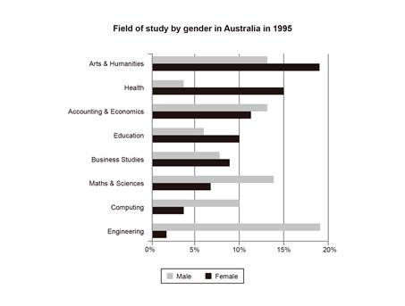

## 维度

第一，性别（2）

第二，学科（8）

## 问题：应该从哪个维度划分细节段落？

首先：选择项目数量多的维度（A）作为“分组的维度”。

其次：具体写作过程中，另外一个维度（B）是“比较的维度”。

 

## 对于上述这个图表

分组维度：学科4+4

比较维度：男女

跟简单的概括：首先使用学科来分段，然后在每个段落中再比较不同学科【男女的不同选择】。

## 为什么这样做？

答案：为了避免重复！

 

第一种：

细节段1：写男

学科1、学科2、学科3、学科4、学科5、学科6、学科7、学科8

细节段2：写女

学科1、学科2、学科3、学科4、学科5、学科6、学科7、学科8

 

第二种：

细节段1：学科1、学科2、学科3、学科4

男、女

细节段2：学科5、学科6、学科7、学科8

男、女

 

## 多维图表的细节信息分组的方式

**The chart below give information on the ages of the populations of Yemen and Italy in 2000 and projections for 2050.**

**Summarize the information by selecting and reporting the main features and make comparisons where relevant.**

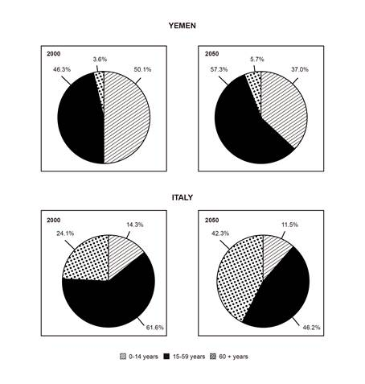

### 维度

维度1：年龄组

维度2：国家

维度3：年份

### 问题：应该从哪个维度划分细节段落？

首先：选择包含所有图表的维度（A）作为“分组的维度”。 

其次：写作过程中，另外多个维度（B及C）作为“比较的维度”。

 

### 为什么这样做？

答案：更容易产生“更全面的”交叉的比较。

 

### 对于上述这个图表

分组维度：不同年龄群体

比较维度：国家、年份

 

第一个细节段：0-14岁组的全方位数据（4张图）呈现及比较；

 

第二个细节段：15-59及60+的全方位数据（4张图）呈现及比较。

 

### 提问：如果为了保证文字量协调，15-59及60+组写得不如0-14组具体，可以吗？

 

### 提问：如果两个段落的文字量不是很协调，可以吗？

 

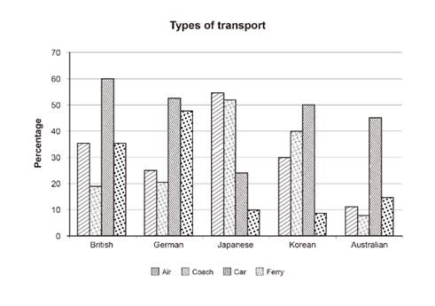

 

## 接下来：细节信息的要点选择（模板）

总原则1：1个细节段写6个左右“分句“即可。

（数据A是所有数据中最高的，从65增长到70。← 这是：）

总原则2：对于细节“要点”的选择（也就是这6个分句分别需要写什么），其实基本是固定的。 

 

## 顺位

### 第一位：最极端的1项（2+句）

先写：数值本身

再写：附加内容

问题：什么是相关内容？

回答：

 

### 第二位： 有相似性的2-3项（2+句） 

问题：

回答：

先写：相似

再写：差异

 

### 第三位：补充自选项（0~2句）

补充：1~2个其他数据项。

选择原则：把还没有写到的项目补上。

 

## 举例1：

**The graph below gives information from 2008 report about consumption of energy in the US since 1980 with projection until 2030.**

**Summarize the information by selecting and reporting the main features and make comparisons where relevant.**

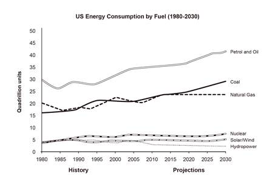

## 举例2：

**The chart below contains informtation about the percentage of male and female students who enrolled diffferent subjects in 1995.**

**Summarize the information by selecting and reporting the main features and make comparisons where relevant.**

## 

 

## 提问：如何体现多样性

第一，

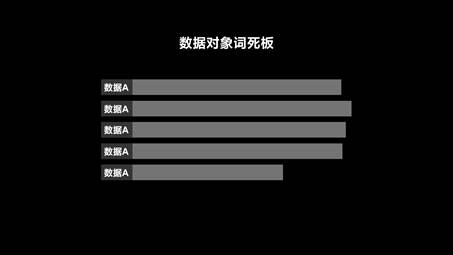

第二，

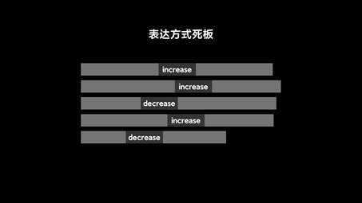

第三，

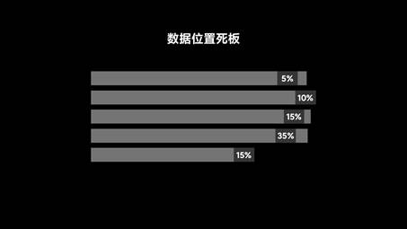

 

## 数据对象词的变化

注意：不是一个单词

但是：正因为数据对象词往往有很多修饰语

举例：下图展现了：不同年龄层+会去健身房+人的+比例。

 

### 恒星系统

原则：修饰语基本都倾斜在核心词的一侧。

The percentage of people aged 18-24 who visited gyms was generally the highest.

This figure for people aged

 

### 双星系统

原则：让核心词左边有两个修饰语、右边有两个修饰语。

The gym-visiting percentage of people aged 18-24 was the highest.

gym goer

The 18-24 year old percentage of people who visited gyms

 

### 星团系统

原则：句子中的所有元素（不仅仅是修饰语）都可以灵活变化位置。

The highest percentage of gym visiting people was among people aged 18-24.

 

## 总结

对于数据对象词的灵活替换，并不是“死气白咧”的去想同义词。

 

## 数值及趋势本身的表达

总原则：数值、百分比、趋势，咱们各自会2-3种表达即可。

数值：figure, data, number/amount, value

百分比：percentage, proportion

趋势：trend\pattern（走势）

 

## 数值（阿拉伯数字）与句子的关系 

### 总原则：

1. 当数据的对象与数值本身临近时，不使用逗号进行隔开（介词使用at或with）。
2. 当数据的对象与数值本身不临近时，使用逗号进行隔开（介词使用at或with）。
3. 对于第一种情况，也可以使用括号给出数值（省略介词at或with）。

### 标点的添加互动：

在[]中选择填入或不填入逗号：

A similar trend can be seen in figure A [❌] with an increase from 5 to 10.

Figure A remained unchanged [，] at 10 from year M to N.

Figure A is 10 in year M [，] with an increase to 20 in year N.

括号的情况：

Figure A and B both increased to a peak (10 and 20, respectively) in year N.

 

## 占比的表达

### 比例本身的表达

总原则：%最好不要单独写，周围一定要跟内容。

不优秀：5% is A.

不优秀：A is 5%. 

 

优秀：5% (of) B is A.

A represents 5% of B.

 

进一步优秀（加一个小修饰）：A represents a proportion of 5% of B.

A占据了B的5%。

A占据了B的5%的比重。

a 5% proportion

 

A represents a proportion of B at 5%.

 

### 继续推进：“占比”的表达

【A在B中占/构成5%左右】

A represents 5% of B.

A accounts for 5% of B.

A makes up 5% of B.

A comprises 5% of B.

 

【B中5%是被A构成的】

5% of B is composed/made up of A.

 

【5%的B是来自A的】

5% of B is from/belongs to A.

 

## “数据本身（单独的数值）”的表达讲完了

## 继续推进：“数据变化（趋势）”的表达

简单来说：上升、下降、倍数、差值等的表达方式。

## 先介绍基础中的基础：连接数据的介词\动词\副词

## 提问：“（某数据）为/是某个数值“用英文怎么表达？（介词）

修饰语/伴随状语：at（静态）\with（动态）

Figure A is the highest, at 5% in the year M.

Figure A is the highest, with an increase from 5% in the year M to 10% in the year N.

 

## 提问： ”一个数值/趋势出现在一个数据中”用英文怎么表达？（介词）

回答：in、for

举例：There was an increase in/for figure A

 

## 提问：“从X到Y”用英文怎么表达？ （介词）

回答：from to

举例：increase from 5 to 20

 

## 提问： “变化了某个数值”用英文怎么表达？（介词）

回答：by

举例：increase by 15

 

 

## 提问：“存在/经历了某种趋势”用英文怎么表达？（动词）

表达：see\experience\record\show

举例：

Figure A saw an increase...

The year M/Group M experienced/recorded an increase...

 

## 约数的表达方法（副词）

about、around、approximately

 

## 大于小于的表达方法（副词）

大于：greater than/more than/exceed

小于：lower/less than

 

over（above）

below（under）

 

## 数据表达的“零部件”讲完了

## 接下来：Main Features的写法！ 

**Summarize the information by selecting and reporting the main features and make comparisons where relevant.**

## 上升下降的表达方法

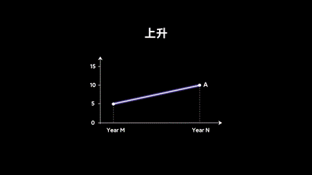

### 首先：使用方法几乎一致的动词/名词

上升：rise、increase、grow/growth

下降：deline、fall、drop

举例：

Figure A rose from 5 to 10.

SVO, rising from 5 to 10.

 

Figure A experienced a fall from 5 to 10.

SVO, with a fall from 5 to 10

 

 

### 其次：一个主要起到修饰作用的词

表达：upward、downward

举例：Figure A showed an upward/downward trend, increasing/falling from A to B

## 最后：补充2个表示增长的词

表达：climb\rebound

用法：4种

 

## 波动和变化的表达方法

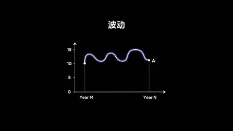

表达：vary/variation、fluctuate/fluctuation

用法：4种

 

## 倍数的表达方法

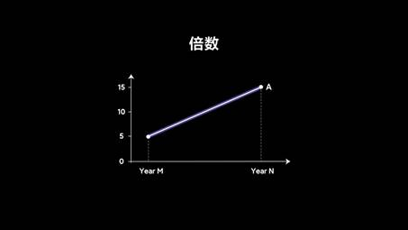

## 动词

表达： double/triple/quadruple

基本表达：Figure A double/triple/quadruple

 

加一个尾巴：Figure A double/triple/quadruple (the original value/X value)

 

## X times

作为形容词：Figure A is 3 times the amount of Figure B.

 

作为名词：Figure A rose (by) two times.

 

## two/three/fourfold

作为形容词： 

翻译：Figure A有一个3倍的增长。

There was a threefold increase in figure A.

 

作为副词：

翻译：Figure A increased threefold (over the original value).

 

 

## 修饰倍数的词

表达：almost、more/less than等。 

 

## 稳定的表达方法

动词：remain (stable/constant at a level)

名词：(experienced) a period of stability

 

## 峰值的表达方法

表达：peak、highest point、lowest point

基本的动宾结构：reach a lowest point/highest point (peak)

动词的同意替换：achieve、hit、attain

如果加具体数字：

1. 动词+at/with+数值
2. 名词+at/with/of+数值

reach a lowest point/highest point (peak) + at 90%

peak的动词用法：

Figure A peak at 90%。

SVO, peaking at 90%

## 等值的表达方法

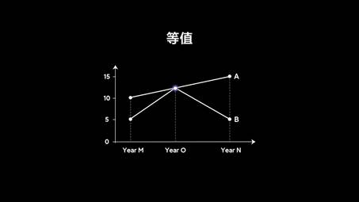

两正：

AB同侧：Figure A an B are almost equal/same (in value).

AB对侧：Figure A is approximately the same as B.

一反：

There is little difference between figure A and B.

 

## 反超的表达方法

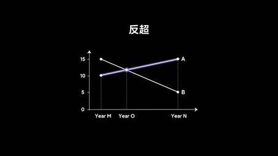

表达：overtake (take over)、surpass

造句：Figure A overtook figure B in the year O.

 

## 差距的表达方法

### 差距本身的表达

表达：gap、difference、disparity

### 差距的变大变小

变大：widen/increase/grow/become larger

变小：narrow/decrease/reduce/become smaller

造句：The difference between figure A and B is no more than 5 from year M to N.

 

### 差距在某个范围之内

表达：within the range of/from 5 to 10

no more than/less than

造句：The difference between figure A and B is no more than 5 from year M to N.

 

## 特定时间的表达方法

 

By the year M, figure A 一般过去时/过去进行时 increased from A to B

 

Starting from the year M, figure A

 

From the year M to N (during), figure A

 

The year M marked a point when figure A

 

during/throughout the recorded period

during the first decade

during the rest of period

 

## 补充：when、which、介词+which在小作文中的使用

### when修饰：时间点

造句：Figure A increased to 10 in the year O, when figure B decreased to the same value (10).

 

### which修饰：数据

造句：In year O, figure A，which then increase to 100， overtook figure B, which then decline gradually to 10.

注意：

### 介词+which修饰：时间段

介词通常是：during、before、after、by

 

造句：

Figure A increased from 10 to 20 from the year M to N, during which figure B remained constant at 15.

Figure A experienced a decline from 20 to 10 starting from the year O, before which there was a rebound for this figure.

 

## 只有个别特殊值的表达方法

中文：除了、即使

英文表达：

Despite a slight fall from 10 to 8, figure A increased to 100 during the ...

Except：相似性

Except for：差异性
