## 接下来：如何让数据在句子中的位置不死板！

总原则：换主语。

因为：

方法：

**The charts below give information on the ages of the populations of Yemen and Italy in 2000 and projections for 2050.**

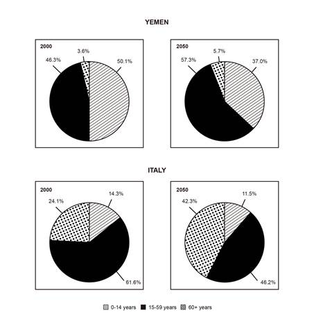

## 换主语的方法一

原则：用数据本身作为主语，也就是开门见山的给出一个阿拉伯数字。

中文：50.1%的也门人口是属于0-14岁组的（在2000年）。

举例：50.1% of the Yemen's population was in/among///belonged to the 0-14 year old group in the year 2000.

 

## 换主语的方法二

原则：使用there be句型，也就是表示：“那存在”某一个数值。

中文：（那存在）50.1%比例的也门人口是属于0-14岁组的。

举例：There was a proportion of 50.1% Yemen's population in/among///belonging to the 0-14 year old age group in the year 2000.

 

## 换主语的方法三

原则：“信息维度”往往有多个，每个维度都可以做主语。

 

举例：

从年份出发：2000年呈现了50.1%的也门人口是属于0-14岁组的。

The year 2000 saw a percentage of 50.1% of Yemen‘s population among/belonging to the 0-14 year old group.

从年龄组出发：0-14岁组占据了（构成了）也门人口的50.1%。

The 0-14 year olds made up a proportion of 50.1% of Yemen's population in 2000.

从国家出发：也门的人口被50.1%的0-14岁的人群所组成。

Yemen's population was composed of 50.1% individuals aged 0-14 years old in 2000.

 

### 补充：年龄的表达

【表达：年龄】

year old：前置修饰语

18 year-old people

years old：后置修饰语

people aged 18 years old

year olds：名词（人）

18 year olds

 

## 换主语的方法四

原则：对数据的“评价”可以作为主语。

中文：最高的比例（50.1%）de也门的人口是在0-14岁组中的。

 

翻译：The highest proportion of Yemen's population (50.1%) in 2000 was among the 0-14 year old group.

 

## 换主语的方法五

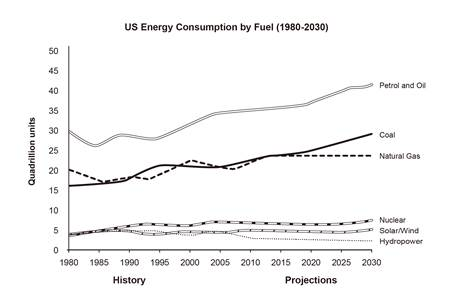

原则：

客观写法：The consumption of petrol and oil has been the highest, and it is projected to remain the first place until 2030.

主观写法：People preferred to use petrol and oil as their main sources of energy, and this trend is likely to continue until 2030.

 

## 补充：时态的使用

### 一般过去时

原则：通常使用一般过去时。

### 一般将来时

原则：对于数据中的预测部分，使用一般将来时。

造句：

will do

is expected to do

is projected to do

### 进行时

原则：表示一个状态的持续性时，可以使用进行时。

造句：Figure A was increasing constantly until the year N.

### 完成时

原则：同时存在“过去”及“将来”，对”过去“的描述可以使用现在完成时。

过去完成 -- 一般过去 -- 现在完成 -- 现在 -- 将来

造句：Figure A has been the lowest, and it will be the lowest until the year N.

 

A was moved to the west.

PAST

There was an A to the east.

A has been moved to the west.

A was moved to the west.

NOW

There is an A to the west.

 

 

## 【接下来推进到高分原则的第三项：多合并】

策略：4

 

## 策略一：评价+具体数值或趋势

原则： 前句是概括性或评价性的描述（客观评价），后句连接更具体的趋势或数字。

静态版：Figure A is the highest over time, at 50 in the year M and 100 in the year N.

动态版：Figure A experienced a steady growth, rising from 50 to 100.

### 补充：也可以把评价写在后句。

注意：

造句：

 

## 策略二：前+后

适应场景：数据明显存在一个转折点。

### and (then)/which then

中文：在M年数据A为10，而后增加成为20。

英文：

In the year M, figure A is 10, and then increased to 20 in the year N.

In the year M, figure A is 10, which then increased to 20 in the year N.

 

### follow

翻译：随之而来的是...

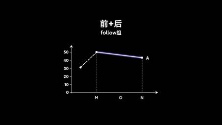

中文：数据A在达到了一个顶点50%后，紧随其后是一个持续了O年的逐渐下降。

英文：

Figure A reached a peak of 50% in the year M, followed by a O-year decline to 40%.

Figure A reached a peak of 50% in the year M, with a following decline for O years to 40%.

 

### after

使用方法：

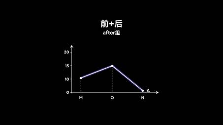

中文：在一个从10%到15%的增长后，数据A跌至几乎为0。

提问：after后面可以连接单词还是句子。

英文：

After an increase from 10 to 15, figure A dropped to nearly zero...

After figure A increased from 10 to 15, it dropped to nearly zero....

 

## 策略三：方式一+方式二

回答：

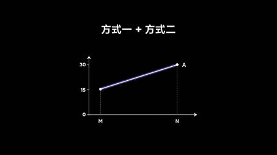

中文：在N年数据A增长至30，是M年的2倍。

英文：The year N saw a rise to 30 in figure A, around 2 times higher than this figure (15) in the year M.

 

# 策略四：主句+对比/类比

注意：

原因：

注意：

### 注意：以下讲解3种不同词性的引导对比与类比关系的用法

### 第一种：连词

用法：连接句子（分句），标点使用逗号。

表达：while、although

句型：While/although 句子1（趋势1），句子2（趋势2）

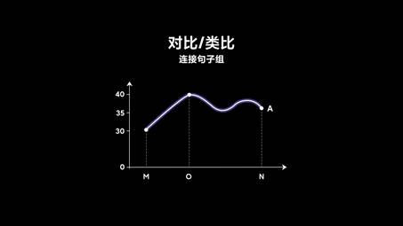

中文：虽然数据A从M年到O年有一个显著的从30到40的增长，但是从O年到N年一直在35与40之间波动。

 

英文：Although figure A recorded a significant growth from 30 to 40 by the year M, this figure remain basically unchanged between 35 and 40 from the year O to N.

 

### 第二种：副词

用法：在完整句的开头单独存在。

表达：Similarly、In contrast (However)

句型：句子1（趋势1）。Similarly/In contrast, 句子2（趋势2）。

 

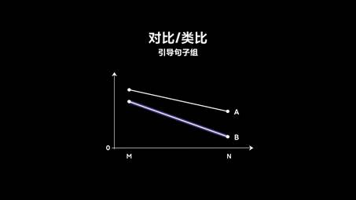

英文：Figure A saw a noticeable decline. Similarly, figure B decreased sharply.

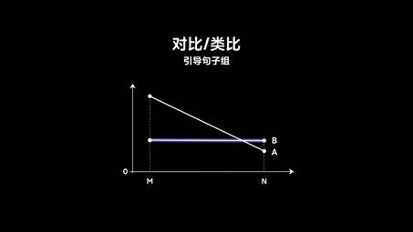

英文：Figure A saw a noticeable decline. In contrast, figure B remained constant over time.

 

### 第三种：形容词

表达：similar、different

用法：修饰表达“趋势”的这个【名词】

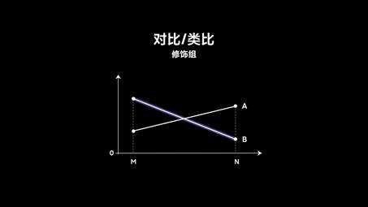

英文：Figure A saw an noticeable increase. Different pattern was seen in figure B, which decreased sharply.

 

## 综合举例

英文：

Before the year O, figure A decreased noticeably while figure B recorded an upward trend. In contrast, similar patterns were seen between year O and N, during which both figure A and B deceased gradually.

 

## 最后补充：细节段的关联词

### 第一种

不加任何关联词，直接继续描述数据。 

### 第二种

相似性：

差异性：

### 第三种

As shown in the first graph...

We can see in the second graph...

 

## 图表类小作文写作举例

**The charts below give information on the ages of the populations of Yemen and Italy in 2000 and projections for 2050.**

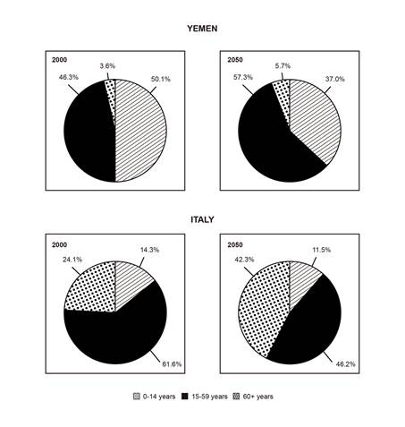

 

## 流程图类小作文

## 流程图类小作文的特点

为什么考察频率低：因为没有区分度。

 

分类：

1. 工序流程图：被动语态（一般现在）
2. 生物生长流程图：主动语态（一般现在）

分段：4段

 

怎样做才能进入高分段：

第一，掌握通用表达

第二，细节段（即使变化的可能性不大），也要写出一些变化

第三，概述段知道写什么

 

## 非常简单的一个要点：细节信息分组

流程总数/2

 

## 流程图类小作文细节段句式变化的方式

### 第一，对“第几步”的同义替换

核心句型：第一步、第二步、第三步。

推荐：非数字化的表达：第一（首先），然后，最后

 

### 补充：阶段表达的同义替换

### 第一阶段

First

At the first stage/step

Initially

In the beginning

Beginning at X stage

### 中间阶段

Next

Then

Subsequently

In the next/subsequent step

in the following phase

### 最后的阶段

Finally

At the final stage

In the concluding phase

 

## 第二，步骤整合

 

## 第三，插入附加信息

第一，文字性（所有）

第二，可视性

 

## 流程图概述段内容的组成

总内容量：2句

### 必写内容

总结步骤总数

### 补充：阶段的总结

注意动词的使用

X consists of/involves three stages

X is comprised/composed of three phases

Three main stages are shown on the diagram that illustrates X

 

### 以下内容任选其一

评价：简单或复杂（simple、complex）

核心：核心材料或工具

比较：多个阶段之间的相似性和差异性

目的：流程最终的目的

 

## 流程图类小作文举例

**The diagrambelow shows the process of construction and use of a modern landfill for household waste**

**Summarize the information by selecting and reporting the main features, and make comparisons where relevant.**  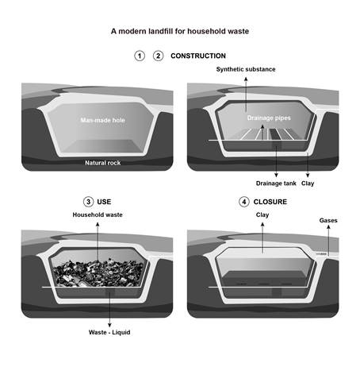     

 

 

## 地图类小作文

## 地图类小作文的特点

为什么考察频率低：因为没有区分度。

方位、特点、变化

 

分类：

1. 比较类

a. 昨天：今天

b. 布局变化

2. 选址类

 

分段：4段

 

怎样做才能进入高分段：

第一，掌握通用表达

第二，细节段（即使变化可能性很小），也尽量在表达层面有变化。

第三，概述段知道写什么

 

 

## 提问：2类地图题真题中会考哪种

 

## 细节信息分组

常见情况：

分组方式：

第一，每张图写一段

第二，每个区域写一段

 

## 地图类小作文细节段句式变化的方式

一句话概括地图类小作文中所有的句子：

### 第一，方位+There be句型

无特殊说明

举例：To the north, there is an undeveloped beach.

### 第二，倒装句

语法：方位+动词+主语（建筑/设施） 

举例：On the north is situated a fountain.

### 第三，主动句与被动句

语法：

lie使用主动（lay\lied）

be situated/located/sited使用被动 

造句：

Building A lies on the north side.

Building B is sited on the north side.

 

### 第四，以“变化”开头

表达：One change.... Another change....

举例：One change is made to the location of the entrance.

 

## 补充表达：方位

## in、to、on+方位

### 通用用法

表达：在一个大区域的某侧

总原则：大范围（都可以）

更常用：to

### 细分用法

表达：在一个有限区域的某个方位

(A) in the east of B

(A) to the east of B

(A) on the east side of B

### 接part

提问：in/to/on the northern part/side哪个对？

回答：

 

## 补充表达：道路

### 走向

名词词性：an east-west road

动词词性：a road running east to west

 

### 转角：at...

单条路：corner turn

十字路：cross junction

小弯路：bent

 

## 补充表达：占据

动词：occupy和cover

主动：occupy the area

被动：area being covered by

 

## 地图概述段内容组成

## 2句话

### 必写内容

对变化的总体评价（大或小）

has undergone a siginificant transformation

### 选写内容

最重要的变化主体的变化方式。

 

## 地图类小作文举例

**The diagram below shows the present and planned development in the biomedical campus of a university.**

**Summarize the information by selecting and reporting the mainfeatures, and make comparisons where relevant.**    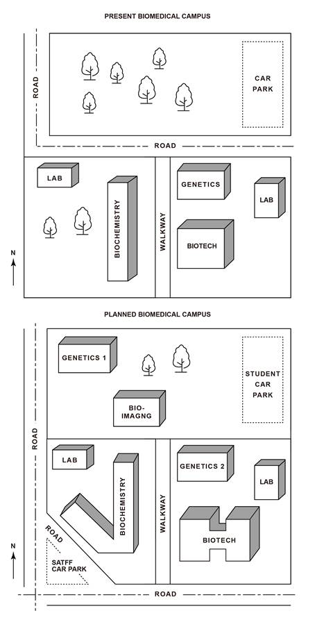     

 