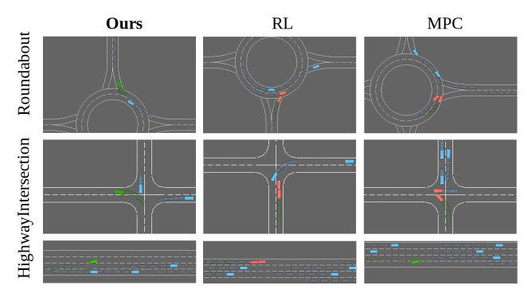

**Junzhou Chen** and Sidi Lu

## Abstract

 As deep learning technology advances Autonomous Driving (AD), existing AD methods encounter performance limitations, especially in handling corner cases, interpretability, and verifiability, which are crucial for the safety of connected and autonomous vehicles. Multimodal Large Language Models (MLLMs) demonstrate remarkable understanding and reasoning capabilities, presenting a transformative opportunity to overcome challenges faced by traditional AD algorithms. We conducted a comprehensive study on the application of MLLMs in AD, exploring their potential to address critical challenges faced by traditional AD algorithms. We construct a Visual-QuestionAnswering dataset for model fine-tuning to address hallucinations and poor logic analysis issues in MLLMs. We then decomposed the AD decision-making process into Sense Understanding, Prediction, and Decision, allowing MLLMs to construct Chainof-Thought to make decisions step by step. Subsequently, we proposed a new framework enabling models to perform AD tasks under conditions of limited local computing resources, few-shots, multimodality, and complex scenarios, enhancing the flexibility of future AD system deployment. Our extensive experiments and indepth analyses demonstrate the significant advantages of MLLMs for AD. We also discuss the strengths and weaknesses of existing methods, providing a detailed outlook on MLLMs in AD.

<!-- 

 The overall workflow of the purified Stacking ensemble, where KFSC represents k-fold split and concatenation, DW-Voting represents distance weighted voting and MLR with AW-Softmax represents multinomial logistic regression model with adaptive weighted softmax loss function.
 -->

  
   
  
 
  <strong>Framework of the Multimodal Large Language Model for Autonomous Driving </strong>    An end-to-end autonomous driving framework with a Multimodal Large Language Model (MLLM) at its core. The MLLM integrates multimodal information with memory and prompts to make decisions, ultimately outputting action commands.

<par>
<par>

  
   
  
 
  <strong>Comparison with other methods. </strong>    Our method compared with RL and MPC in three scenarios: roundabout, intersection, and highway. In these examples, RL, motivated by time incentives, led to overly aggressive driving and resulted in rear-end collisions. MPC, on the other hand, was unable to predict many uncommon situations, leading to task failures.

[Paper download here](An_Advanced_Driving_Agent_with_the_Multimodal_Large_Language_Model_for_Autonomous_Vehicles.pdf)
