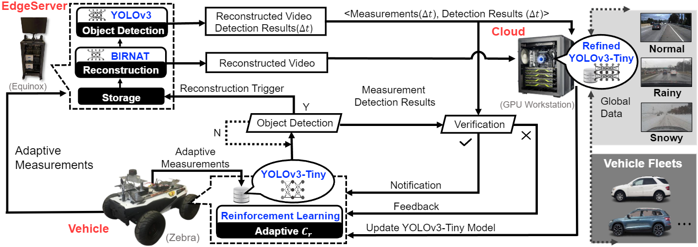

Yichen Luo, Yongtao Yao, **Junzhou Chen**, Sidi Lu, Weisong Shi

## Abstract

Connected vehicles (CVs) face significant challenges in continuous big data transmission, resulting in high transmission bandwidth costs and impacting real-time decision-making. To address this, we propose two dynamic, driving-aware compression mechanisms based on reinforcement learning and temporal compressive sensing to intelligently compress video data. These mechanisms adapt to driving conditions, reducing bandwidth while preserving sufficient information for accurate applications such as object detection and ensuring high-quality reconstruction when needed. We also implement a Vehicle-EdgeServer-Cloud (VEC) closed-loop framework that integrates these mechanisms. Specifically, a lightweight vehicle model performs real-time detection on compressed data (measurements), while the EdgeServer receives measurements and reconstructs scenes if needed. The measurements, reconstructed video, and analysis results are then sent to the cloud for vehicle model updates. Unlike conventional methods, our framework seamlessly adapts across vehicles, EdgeServers, and the cloud, supporting efficient data transmission and dynamic model updates. Extensive evaluations were conducted on our designed roadside unit platform and robotic vehicle, both equipped with industry-grade sensors and computing units. The results demonstrate an 18$\times$ reduction in bandwidth at 320KB/s while maintaining high detection accuracy and reconstruction quality compared to non-adaptive measurements, highlighting the framework's promising real-world applications for CVs.
<!-- 

 The overall workflow of the purified Stacking ensemble, where KFSC represents k-fold split and concatenation, DW-Voting represents distance weighted voting and MLR with AW-Softmax represents multinomial logistic regression model with adaptive weighted softmax loss function.
 -->

  
   
  
 
  <strong>The complete VEC closed-loop framework to integrate TCS </strong>   The complete VEC closed-loop framework to integrate TCS, edge computing, and CVs. The vehicle generates (captures) adaptive measurements based on the RL, which decides adaptive $Cr$ by involving vehicle tracking or measurement similarity analysis, and then a lightweight model (YOLOv3-Tiny) is employed to perform real-time detection based on raw measurements of vehicles. Compressed with low bandwidth measurements are also sent to the EdgeServer to save the information. When the trigger is on, the reconstruction operation is performed by BIRNAT, and a more accurate result of object detection based on the reconstructed video is described by an advanced detection network (YOLOv3), verifying the YOLOv3-Tiny's result. Meanwhile, these results will be sent to the cloud with the saved measurements to refine YOLOv3-Tiny to provide more accurate in-vehicle services. The reconstructed video will also be sent to the cloud to receive related information from vehicle fleets to conduct decision-making such as traffic control and path planning.

<par>
<par>

[Paper download here](https://junzhou-chen.github.io/files/An_Efficient_Data_Transmission_Framework_for_Connected_Vehicles.pdf)

