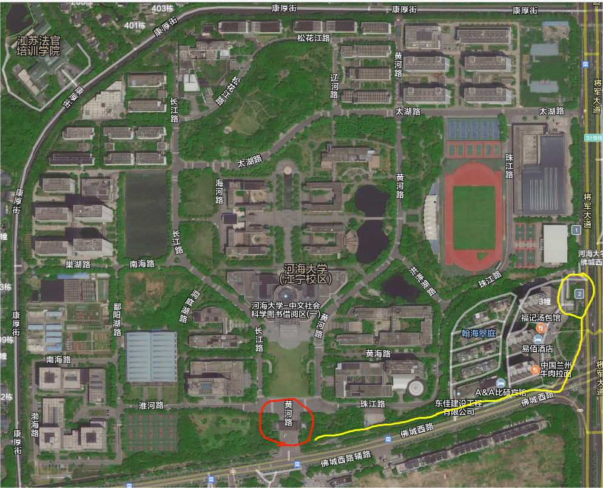
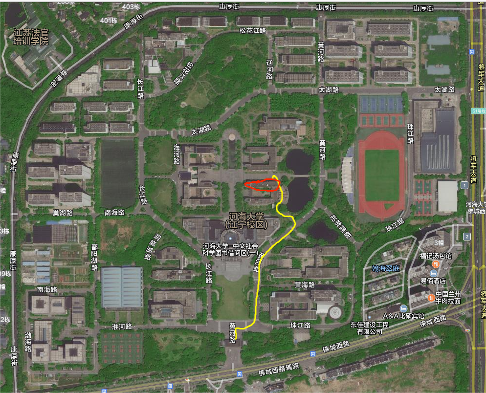
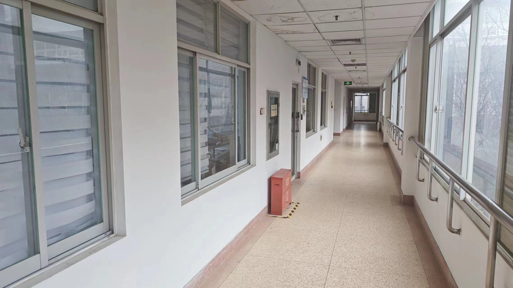
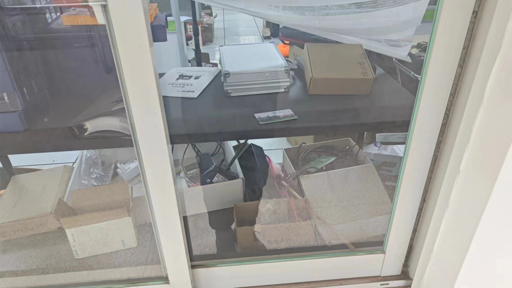
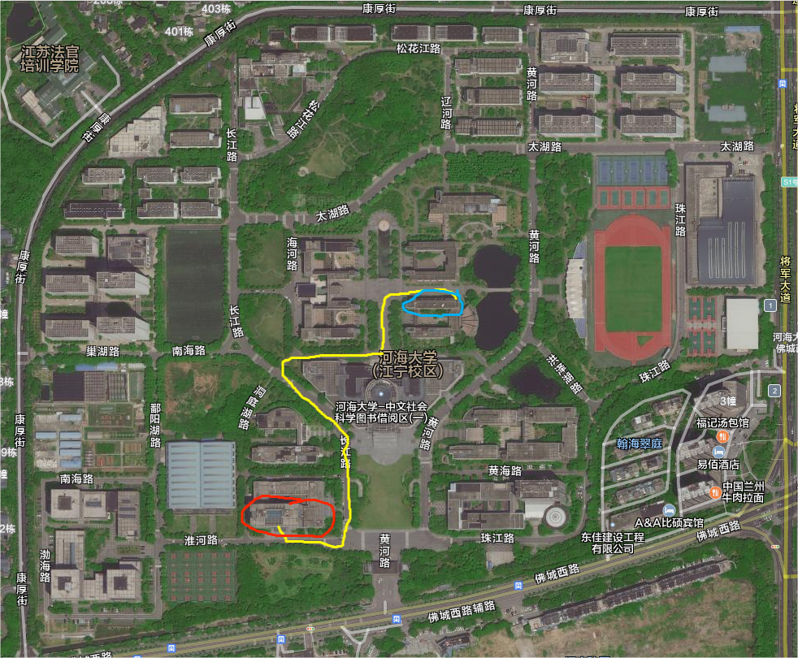
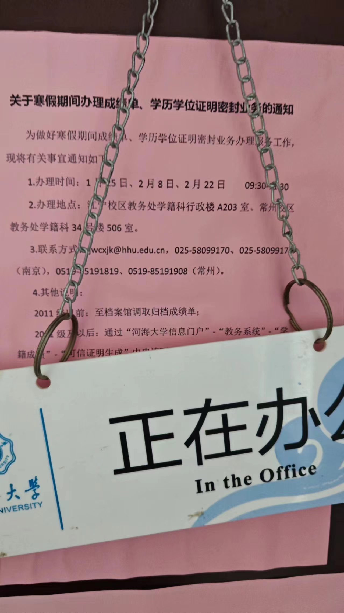

# 帮送快递详细流程

1. 9:45左右到达河海大学江宁校区南门 (ps: S1号线禄口方向第二站即为河海大学江宁校区)，地铁站即为图中黄色圆圈，出站之后向西走即可。目的地为该图片最下方红色圆圈标记位置。大门正常可以直接进入，如果不能的话需要登记，需携带身份证给保安记录一下即可。

   

2. 取学生证，沿黄色路径走到致远楼，即为图二红圈表示地方，前往2楼。在消防栓旁边的窗户内有一个学生证，窗户没有锁，打开取走即可。

   

   

   

3. 持学生证前往教务处，沿原路下楼后，根据图5黄色路径前往行政楼，即为红圈标注。进入无需登记，入门右转前进30米左右可以看到一个电梯，进入电梯选择2楼。

      

4. 电梯打开正对面即为教务处，到达之后是否请开一下微信电话，我会跟教务秘书讲清楚我的需求。教务处门口图片表示如下：

      

5. 到时候应该我会要多份，有一份将寄往美国，我会联系国际快递上门取件，其余的我会联系国内快递上门取件。集体事宜届时再定

6. 请麻烦沿原路返回蓝色教学楼，将我的学生证放回原来位置即可。

      

7. ps：如果想体验学校食堂的话图片左上角和右上角均有食堂……但可能超级难吃，劝退劝退。